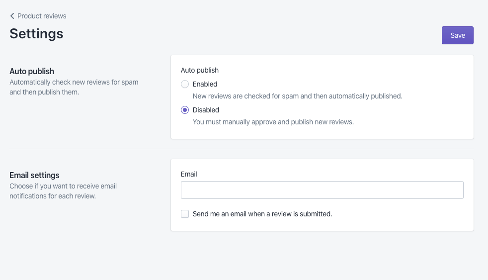

# Polaris Workshop

### What is Polaris?

* Shopify’s design system, provides a common framework with which to build high quality experiences for merchants and partners
* Consists of UI design and development kits, design and content guidelines and more

### How should you use it?

* Style guide
* Guidelines
* Component reference
* What’s new
* Examples

### Workshop overview

Together we will be building out a product review app so merchants can receive and manage customer submitted reviews on their products. 

The workshop comes with some pre-built components and GraphQL already implemented.

At the end of this workshop you will have built something that looks like this.


## Step 1: Setting up your app

[](https://codesandbox.io/s/github/DevDegree/polaris-workshop)

🖥️ Goto the Code Sandbox for this workshop and fork it.
[https://codesandbox.io/s/github/DevDegree/polaris-workshop](https://codesandbox.io/s/github/DevDegree/polaris-workshop)

Ensure you have forked the project and all dependancies have finished loading before continueing.

🖥️ Click on the Live icon in the left hand side of the codesandbox and share the Collaboration link with your teammates.

We have setup the structure of the app up for you. We have included a simple GraphQL server with some dummy data, the React Apollo client to connect the React components with that GraphQL server, and React Router with four routes started for you.

Look at the folder structure. There is a lot in here but these are the most important parts we will be using today are:

* `src/App.js` - This is the top level app component. This is where we initialize the React Apollo client, setup React Router and its routes, and include the `AppProvider` component from Polaris.
* `src/routes` - This is where you will see the four routes we have setup for you. A review list route, a review details route, a settings route, and the not found route for 404s.
* `src/components` - This is where we have the custom components we have built for our app. There are two components here. A `Rating` component used to show the number of stars a review has, and the `ReviewListItem` which we will be using to build out our resource list on the index page.

## Step 2: Review index

Go ahead and open up the review list file located at`src/routes/ReviewList.js`. If you scroll to the bottom of the file, you will see we have a GraphQL query setup to fetch the list of reviews.

This injects a `data` prop into our `ReviewList` component that gives us an array of "reviews" and a "loading" boolean that tells us whether or not we're still fetching the reviews.

```jsx
export default graphql(gql`
  query ReviewsQuery {
    reviews {
      id
      title
      status
      date
      customer {
        name
      }
      product {
        name
      }
    }
  }
`)(ReviewList);
```

Now let's walk through how we've built out the UI of this page using the Polaris React component library.

### Page

When building a Shopify app with Polaris React, every view should start with a [Page](https://polaris.shopify.com/components/structure/page) component. All of the view's content will then nest inside of the page.

Below our dependency imports, you'll notice we've imported the page component from Shopify Polaris along with a few other components.

```jsx
import React from 'react';
import {graphql} from 'react-apollo';
import gql from 'graphql-tag';

import {
  Page,
  EmptyState,
  Card,
  ResourceList,
  SkeletonBodyText,
  SkeletonDisplayText,
  TextContainer,
} from '@shopify/polaris';
```

Then we've got a functional React component named `ReviewList` that returns the page.

```jsx
function ReviewList({data: {loading, reviews}}) {
  /* Content logic... */
  return <Page title="Product reviews">{/* Page content... */}</Page>;
}
```

The page component requires a `title` prop, which accepts a string to give the page a title.

So far, our page looks like this


There are a number of optional props the page component accepts as well. One of those optional props is a list of secondary actions. Let's head over to the [style guide](https://polaris.shopify.com/components/structure/page) to explore what the `secondaryActions` prop accepts as a value.

We want to add an action that will link to the settings page we've built so our page looks something like this.


We have already imported the gear shaped SVG we've included in this project. We'll use that as the icon property of our secondary action.

```jsx
import {settings} from '../icons';
```

🖥️ Add a `secondaryActions` prop to the page component. Give it an array with a single object. This array will map to a settings button below our page title. As you can see in the style guide prop explorer, secondary action objects can have a lot of different properties. Which will we need to replicate the screenshot above? Try it figure this out using the Polaris Documentation before checking the answer.

<details>
<summary>Click for answer.</summary>
We will only give our settings action an icon, content, and url.

```jsx
<Page
  title="Product reviews"
  secondaryActions={[{icon: settings, content: 'Settings', url: '/settings'}]}
>
  {/* Page content... */}
</Page>
```
</details>

### Card

Now let's dig into the content of our page. When building a new view for your application you should always consider the different states your page will have based on the availability and quantity of the data being presented: loading, empty, some, and many.

#### Loading state

We start with the loading state content. This is what should be shown while the network request fetches the review data through GraphQL.


We hold the content of our loading state in a variable that uses the `loading` property of the `data` prop to determine whether or not we should show this content.

We wrap the loading state content with a card component. Cards are used to group similar concepts and tasks together to make Shopify easier for merchants to scan, read, and get things done.

```jsx
const loadingStatePageContent = loading ? (
  <Card sectioned>
    <TextContainer>{/* Skeleton components... */}</TextContainer>
  </Card>
) : null;
```

Polaris comes with a set of skeleton content components that can be used to communicate to the merchant that data is currently being fetched. Let's go back to the [style guide](https://polaris.shopify.com) take a look at those components.

🖥️ Use the search bar (top right) to find the "skeleton" components we've imported at the top of the file. look at the different examples provided by selecting from the example menu at the top of the page and play with the component code in the playground and explore the props list. Add Skeleton components to this Card to resemble the screenshot above.

<details>
<summary>Click for answer.</summary>

```jsx
const loadingStatePageContent = loading ? (
  <Card sectioned>
    <TextContainer>
      <SkeletonDisplayText size="small" />
      <SkeletonBodyText />
      <SkeletonBodyText />
    </TextContainer>
  </Card>
) : null;
```
</details>

🖥️ The loading state content is already a child of our page. We can see what our loading state looks like by uncommenting the two lines of code below line 18.

```jsx
/* Comment or uncomment the next two lines to toggle the loading state */
loading = true;
reviews = null;
```

### Empty state

Next, let's go over how to build out our page's empty state using the Polaris `EmptyState` component. This is what will be displayed when we aren't loading data but there are no reviews for the merchant's products yet.


Let's add the empty state component to our Polaris component import.

We store the content of the empty state in a variable just like we did for our loading state. We use the length of the `reviews` array we receive from the GraphQL query to decide whether or not to show the empty state.

```jsx
const emptyStateContent =
  reviews && reviews.length === 0 ? (
    <EmptyState
      heading="You haven't received any reviews yet"
      image="/review-empty-state.svg"
    >
      <p>Once you have received reviews they will display on this page.</p>
    </EmptyState>
  ) : null;
```

🖥️ We can see what the empty state of our page looks like by commenting out lines 19 and 20, and uncommenting the code on line 23.

```jsx
/* Comment or uncomment the next two lines to toggle the loading state */
// loading = true;
// reviews = null;

/* Comment or uncomment the next line to toggle the empty state */
reviews = [];
```

Let's look at our page now that we've handled the case of a store without reviews. Uh oh, there's a lot of errors here! When running into errors with Polaris components, a good first step is to double check the style guide to make sure we haven't forgotten any required props.

Looking at the [empty state page of the style guide](https://polaris.shopify.com/components/structure/empty-state), we see an asterisk next the `action` prop. This means adding an `action` prop to the empty state component is **required**. This is because it is a best practice to give merchants a relevant, meaningful next step they can take after reaching an empty page.

🖥️ Using the Polaris Documentation try adding an action prop to our empty state component that will link the merchant to the settings page.

<details>
<summary> Click for answer...</summary>

```jsx
<EmptyState
  heading="You haven't received any reviews yet"
  action={{content: 'Configure settings', url: '/settings'}}
  image="/review-empty-state.svg"
>
  <p>Once you have received reviews they will display on this page.</p>
</EmptyState>
```

</details>

Now we can see our empty state!

### Resource list

The last variable we create stores the content of the list of reviews. We use the length of the array of reviews we receive from GraphQL to determine whether or not we render the reviews list. To wrap our reviews list content, we use a card component just like we did for our loading and empty state content.

```jsx
const reviewsIndex =
  reviews && reviews.length > 0 ? (
    <Card>{/* add a ResourceList of reviews here... */}</Card>
  ) : null;
```

To build the list of reviews, we will use the Polaris `ResourceList` component. `ResourceList` displays the key details of a collection of resources (reviews in this case) that allow a merchant to find, select, take bulk action on, or navigate to see more details about each resource.


Since every type of resource is different and requires different information to be shown, we allow you to customize the display of each item in the list by using a custom component instead of the `ResourceList.Item` subcomponent. For this app, we created a custom component called `ReviewListItem` and have already imported it into this file.

```jsx
import ReviewListItem from '../components/ReviewListItem';
```

🖥️ Let's start building our index. First, place a resource list component inside of the card in the `reviewsIndex` variable.

```jsx
const reviewsIndex =
  reviews && reviews.length > 0 ? (
    <Card>
      <ResourceList />
    </Card>
  ) : null;
```

🖥️ Next, let's go back to the [Polaris style guide](https://polaris.shopify.com) and search for "resource list" so we can explore what props to pass into to our resource list. Try you best to determine which props you'll need to match the screenshot above. 

<details>
<summary>Click for answer...</summary>

```jsx
const reviewsIndex =
  reviews && reviews.length > 0 ? (
    <Card>
      <ResourceList
        showHeader
        resourceName={{singular: 'review', plural: 'reviews'}}
        items={reviews}
        renderItem={(review) => <ReviewListItem {...review} />}
      />
    </Card>
  ) : null;
```

> * The `showHeader` prop is an optional boolean that toggles whether or not a heading with a count of the list items is shown.
> * The `resourceName` prop is also optional. It takes an object that specifies the singular and plural names of the resources so the component can use them when referencing the resources in places like the heading. If left blank, the resource list will just default to calling them items.
> * The `items` prop is required as well and takes an array of objects. We pass the resource list our array of review objects here.
> * The `renderItem` prop is a callback function used by the resource list to map over and render the list of resources the `items` prop receives. Here is where we will instruct the component to render each review with our custom `ReviewListItem` component.

</details>

Finally, our reviews list view is complete!

<details>
<summary>Click to view the finished ReviewList.js code</summary>

```jsx
import React from 'react';
import {graphql} from 'react-apollo';
import gql from 'graphql-tag';
import {
  Page,
  EmptyState,
  Card,
  ResourceList,
  SkeletonBodyText,
  SkeletonDisplayText,
  TextContainer,
} from '@shopify/polaris';

import ReviewListItem from '../components/ReviewListItem';
import {settings} from '../icons';

function ReviewList({data: {loading, reviews}}) {
  const loadingStateContent = loading ? (
    <Card sectioned>
      <TextContainer>
        <SkeletonDisplayText size="small" />
        <SkeletonBodyText />
        <SkeletonBodyText />
      </TextContainer>
    </Card>
  ) : null;

  const emptyStateContent =
    reviews && reviews.length === 0 ? (
      <EmptyState
        heading="You haven't received any reviews yet"
        action={{content: 'Configure settings', url: '/settings'}}
        image="/review-empty-state.svg"
      >
        <p>Once you have received reviews they will display on this page.</p>
      </EmptyState>
    ) : null;

  const reviewsIndex =
    reviews && reviews.length > 0 ? (
      <Card>
        <ResourceList
          showHeader
          resourceName={{singular: 'review', plural: 'reviews'}}
          items={reviews}
          renderItem={(review) => <ReviewListItem {...review} />}
        />
      </Card>
    ) : null;

  return (
    <Page
      title="Product reviews"
      secondaryActions={[
        {icon: settings, content: 'Settings', url: '/settings'},
      ]}
    >
      {emptyStateContent}
      {loadingStateContent}
      {reviewsIndex}
    </Page>
  );
}

export default graphql(gql`
  query ReviewsQuery {
    reviews {
      id
      title
      status
      date
      customer {
        name
      }
      product {
        name
      }
    }
  }
`)(ReviewList);
```

</details>
<br />

---

## Step 3: Review details

Now that we have our index page working, we will move onto the page to display the details for each review.

What we want to end up with is something like this:


### Layout

Looking at our mockup for this page we will notice it should display in two columns on larger screens but currently our page is only a single column. We are going to use the `Layout` component from Polaris for this.

To do this, let's open up the style guide and search for layout. We will see there is an example for two column layouts. 

You will notice that the `Layout` also has a subcomponent for `Section`. This section component takes a `secondary` prop that we will use on the second column.

🖥️ Let's use that example and use it in `ReviewDetails`. The `Layout` should go inside the `Page` component, but wrap our cards and content.

<details>
<summary>Click for answer...</summary>

```jsx
<Page
  title={review.title}
  breadcrumbs={[{content: 'All reviews', url: '/'}]}
>
  <Layout>
    <Layout.Section>
      <Card title="Review" sectioned>
        {/*...*/}
      </Card>
    </Layout.Section>
    <Layout.Section secondary>
      <Card>
        <Card.Section>
          <Stack alignment="center" distribution="equalSpacing">
            <Stack alignment="center">
              <Thumbnail
                source="https://cdn.shopify.com/s/files/1/1602/3257/products/paste-prod_thumb.jpg"
                alt=""
                size="medium"
              />
              <TextStyle variation="strong">
                {review.product.name}
              </TextStyle>
            </Stack>
            <Stack>
              <Rating value={review.product.averageRating} />
              <p>{review.product.reviewCount} reviews</p>
            </Stack>
          </Stack>
        </Card.Section>
      </Card>
    </Layout.Section>
  </Layout>
</Page>
```

</details>

### Stack

Where the `Layout` component works really well for overall page layout, the `Stack` component is designed for laying out the micro layouts within the page.

Stacks can be used to align and space elements in a way that will wrap responsively based on the content size and the space available.

Uncomment the content within the card titled "Review", we will see it doesn't have any layout right now.

This is a visualization of the layout we want to accomplish.


First we will need the vertical Stack. Let's go to the style guide and look up the docs to find out how we can do that.

🖥️ Now we will try wrapping all of that content in the reviews card with our vertical stack. Notice how all of the children now have consistent vertical spacing between them?

<details>
<summary>Click for answer...</summary>

```jsx
<Stack verticle>
  <Avatar customer name={review.customer.name} />
  <p>{review.customer.name}</p>
  {badge}
  <Rating value={review.rating} />
  <p>{review.content}</p>
</Stack>
```

</details>

🖥️ We are also going to use a nested stack to get the avatar, customer name and status badge to show inline. We also will want these to be vertically centered so we will look at the alignment property on stack.

<details>
<summary>Click for answer...</summary>

```jsx
<Stack verticle>
  <Stack alignment="center">
    <Avatar customer name={review.customer.name} />
    <p>{review.customer.name}</p>
    {badge}
  </Stack>
  <Rating value={review.rating} />
  <p>{review.content}</p>
</Stack>
```

</details>

So this looks great, but you will notice the badge is right up against the customer name and we want it to be pushed to the right side. 

🖥️ To do this we are going to use a `Stack.Item` with the fill prop around our customer name. This will allow that content to stretch and fill any space that it can.

<details>
<summary>Click for answer...</summary>

```jsx
<Stack.Item fill>
  <p>{review.customer.name}</p>
</Stack.Item>
```

</details>

Now you will see the badge pushed over to the right side of the card where we want it.

### Badge

Now the badge is in the correct place, but we will notice the color still doesn't match our mockup. Let's open up the badge in the style guide and take a look at how we can do that.

🖥️ We will see that the badge takes a status prop. This status can be used to apply a color to the badge. In our case we will want a `success` badge if the review is published and an `attention` status if it is unpublished.

<details>
<summary>Click for details...</summary>

```jsx
const badge =
  review.status === 'published' ? (
    <Badge status="success">Published</Badge>
  ) : (
    <Badge status="attention">Unpublished</Badge>
  );
```

</details>

Great! We now have a fully working details page for our reviews!

<details>
<summary>Click to view the final state of the ReviewDetails.js code</summary>

```jsx
import React from 'react';
import {graphql} from 'react-apollo';
import gql from 'graphql-tag';
import {
  Avatar,
  Badge,
  Card,
  TextStyle,
  Page,
  Layout,
  Stack,
  Thumbnail,
  SkeletonPage,
  SkeletonBodyText,
  SkeletonDisplayText,
  TextContainer,
} from '@shopify/polaris';

import NotFound from './NotFound';
import Rating from '../components/Rating';

function ReviewDetails(props) {
  const {
    data: {loading, review},
  } = props;

  if (loading) {
    return (
      <SkeletonPage>
        <Layout>
          <Layout.Section>
            <Card title="Review" sectioned>
              <TextContainer>
                <SkeletonDisplayText size="small" />
                <SkeletonBodyText />
              </TextContainer>
            </Card>
          </Layout.Section>
          <Layout.Section secondary>
            <Card sectioned>
              <TextContainer>
                <SkeletonDisplayText size="small" />
                <SkeletonBodyText />
              </TextContainer>
            </Card>
          </Layout.Section>
        </Layout>
      </SkeletonPage>
    );
  }

  if (!review) {
    return <NotFound />;
  }

  const badge =
    review.status === 'published' ? (
      <Badge status="success">Published</Badge>
    ) : (
      <Badge status="attention">Unpublished</Badge>
    );

  return (
    <Page
      title={review.title}
      breadcrumbs={[{content: 'All reviews', url: '/'}]}
    >
      <Layout>
        <Layout.Section>
          <Card title="Review" sectioned>
            <Stack vertical>
              <Stack alignment="center">
                <Avatar customer name={review.customer.name} />
                <Stack.Item fill>
                  <p>{review.customer.name}</p>
                </Stack.Item>
                {badge}
              </Stack>
              <Rating value={review.rating} />
              <p>{review.content}</p>
            </Stack>
          </Card>
        </Layout.Section>
        <Layout.Section secondary>
          <Card>
            <Card.Section>
              <Stack alignment="center" distribution="equalSpacing">
                <Stack alignment="center">
                  <Thumbnail
                    source="https://cdn.shopify.com/s/files/1/1602/3257/products/paste-prod_thumb.jpg"
                    alt=""
                    size="medium"
                  />
                  <TextStyle variation="strong">
                    {review.product.name}
                  </TextStyle>
                </Stack>
                <Stack>
                  <Rating value={review.product.averageRating} />
                  <p>{review.product.reviewCount} reviews</p>
                </Stack>
              </Stack>
            </Card.Section>
          </Card>
        </Layout.Section>
      </Layout>
    </Page>
  );
}

export default graphql(
  gql`
    query ReviewQuery($id: Int!) {
      review(id: $id) {
        id
        rating
        title
        content
        status
        date
        customer {
          name
          email
        }
        product {
          name
          reviewCount
          averageRating
        }
      }
    }
  `,
  {
    options: ({
      match: {
        params: {id},
      },
    }) => ({variables: {id: parseInt(id, 10)}}),
  },
)(ReviewDetails);
```

</details>
<br />

---

## Challenge 01

### Settings Route

Open your `Settngs.js` file in your `/routes` folder.



Using the screenshot above and what we've learned about Polaris components, try your best and achieving a view that resembles the screenshot above. The Settings page should follow the same structure as `ReviewList.js` and `ReviewDetails.js`. 

This page does not have to be functional. Focus on finding and rendering the correct components and props. 

## Challenge 02

### New Review Route

Create a new file, `NewReview.js`, in your `/routes` folder, and add a new route for it in your `App.js`

Create a new secondary action in `ReviewList.js` called “Add new review”. Find a reasonable icon to show for the secondary action and have it link to this new route.

With no screenshot for comparison, design your own New Review page. It should contain a form that allows you to fill in your name, product name, product rating, and the text for your review. 

Add error checking to the form to make sure the star rating is between 1 and 5.